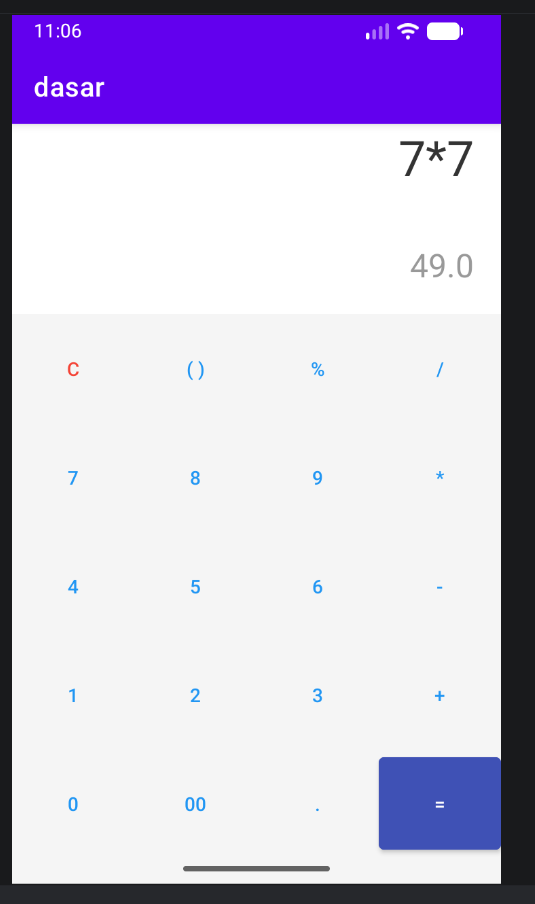

# Tugas 2

## Nama dan Nrp
Muhammad Faturrahman 5027251065

## Kriteria
Kalkulator RelativeLayout

1. Menggunakan RelativeLayout
2. Mengimplementasikan tombol operasi aritmatika (+, -, /, *)
3. Menggunakan Event onClick (tanpa OnClickListener)

## activity_main.xml

Pada acitivity_main.xml perubahan yang terjadi dari tugas sebelumnya adalah mengubah dari setOnClickListener ke onClick, selain itu adanya perubahan RelativeLayout juga.

## MainAcitivity.java

Kita hanya butuh satu fungsi onKlikTombol untuk menangani semua input. Agar sederhana, kita akan membuat logika kalkulator yang menggabungkan teks (string

## berikut tampilan appnya

